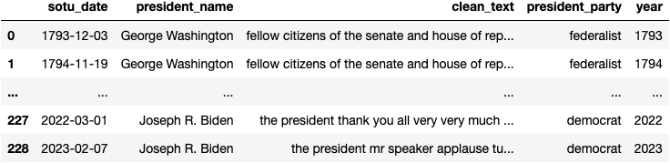
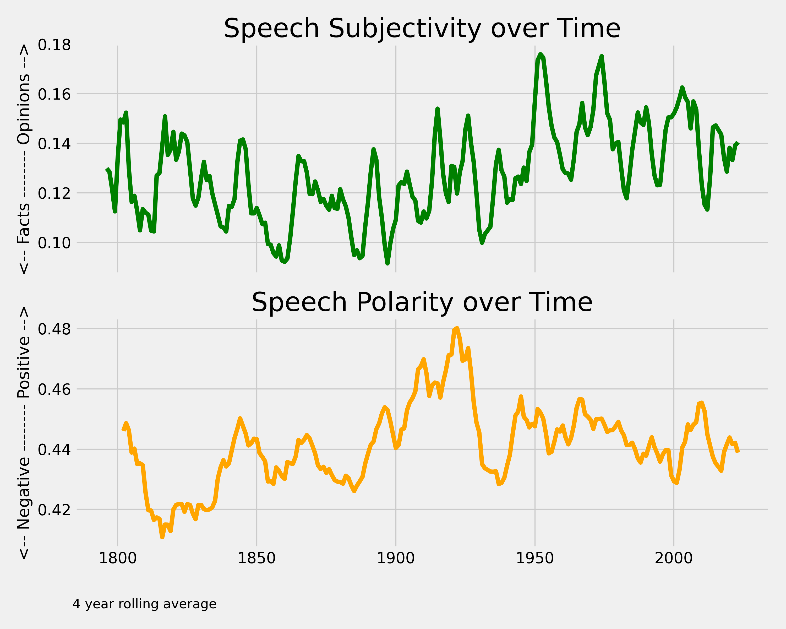
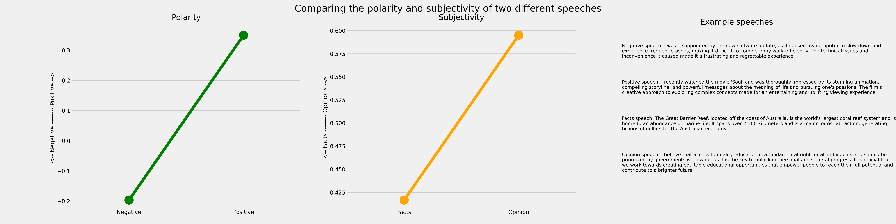
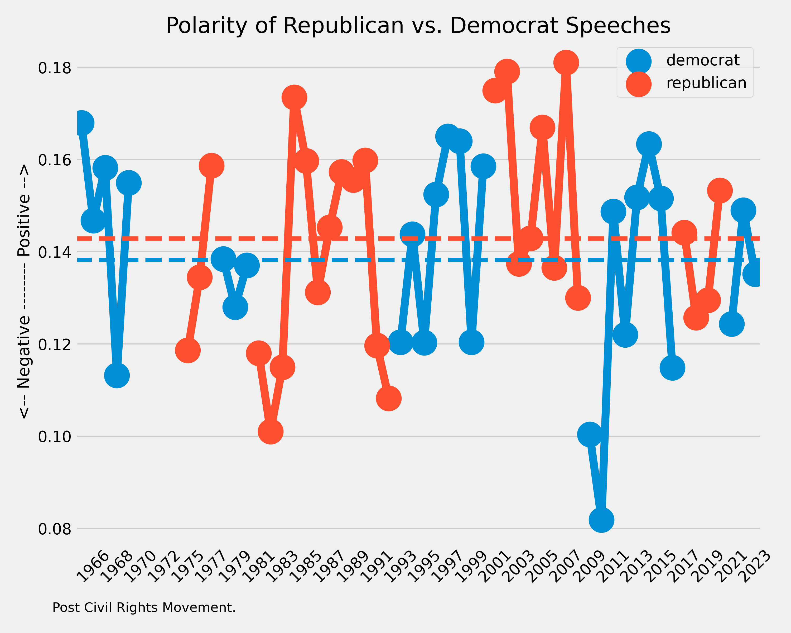
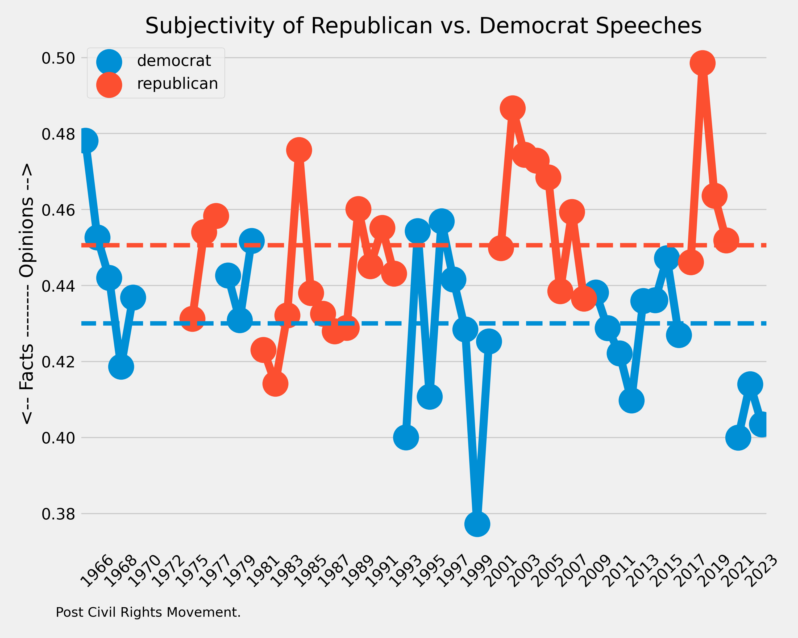

# Analysis of State-of-the-Union Addresses over the Years

### Summary

1. Scraping transcripts of State of the Union Addresses (1793-2019) from [The American Presidency Project](https://www.presidency.ucsb.edu/documents/presidential-documents-archive-guidebook/annual-messages-congress-the-state-the-union), using Selenium and BeautifulSoup (Code included).
   - 229 transcripts and dates were collected from 43 presidents
   - Data was augmented with party information
   - Raw transcripts were cleaned (lower case, removal of punctuations, characters and numbers) before generating a corpus and a document-term matrix (DTM) with Sklearn, organized by president and party for further use.

|  |
|:--:|
| <b>Cleaned corpus (Image by Author)</b>|
  
2. Exploratory Data Analysis was done on the DTM to generate word clouds and a bar graph of the unique words used by each president during their speeches.

|  |
|:--:|
| <b>Word Clouds (Image by Author)</b>|

|  |
|:--:|
| <b>Vocabulary Richness by President (Image by Author)</b>|

3. Sentiment Analysis was done on the cleaned corpus using Spacy and TextBlob to evaluate how speeches have evolved over time and to determine whether these is a clear difference across party lines.

|  |
|:--:|
| <b>Sentiment and Polarity of Presidential Speeches over Time (Image by Author).</b>|

For reference, the following text (generated by GPTChat) received the following scores:

|  |
|:--:|
| <b>(Image by Author; Text generated using GPTChat)</b>|

 

|  |
|:--:|
| <b>Comparing Democrat and Republican Speeches - Polarity</b>|

|  |
|:--:|
| <b>Comparing Democrat and Republican Speeches - Subjectivity</b>|

