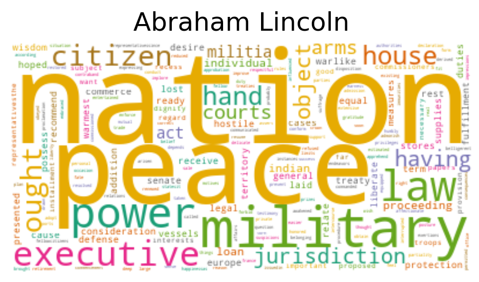

# Analysis of State-of-the-Union Addresses over the Years

1. Scraping transcripts of State of the Union Addresses (1793-2019) from [The American Presidency Project](https://www.presidency.ucsb.edu/documents/presidential-documents-archive-guidebook/annual-messages-congress-the-state-the-union), using Selenium and BeautifulSoup (Code included).
   - 225 transcripts and dates were collected from 42 presidents
   - Data was augmented with party information
   - Transcripts were cleaned before generating a corpus and a document-term matrix (DTM), pickled for further use.
  
2. Exploratory Data Analysis was done on the DTM to generate word clouds and a bar graph of the unique words used by each president.

3. Sentiment Analysis, Topic Modeling and Text Generation were done on cleaned corpus using Spacy and TextBlob.